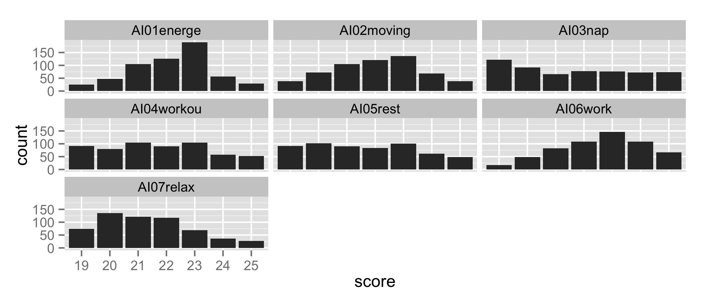
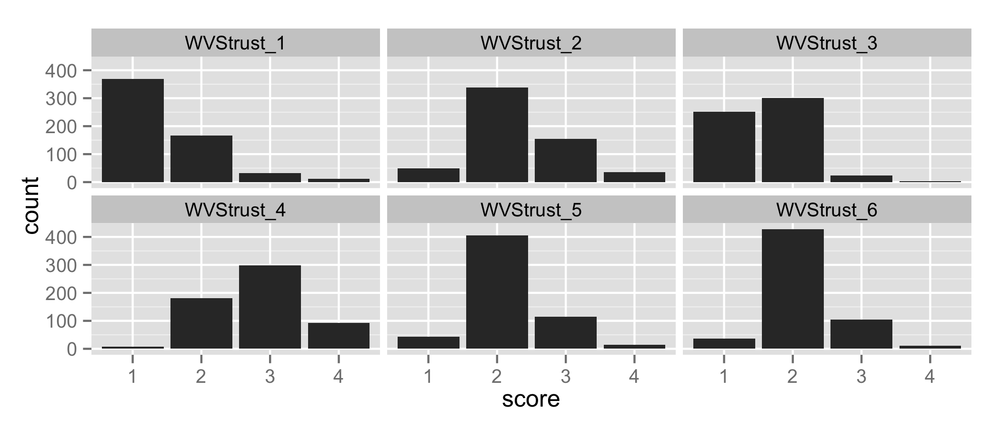
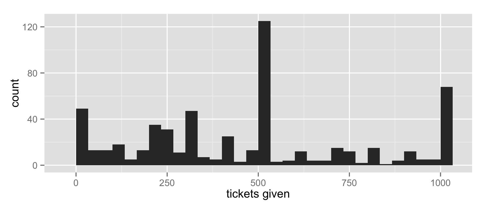
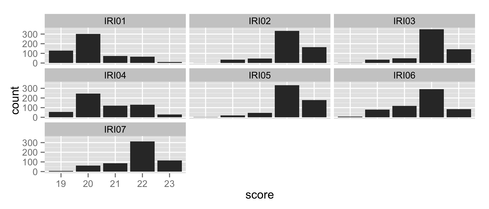
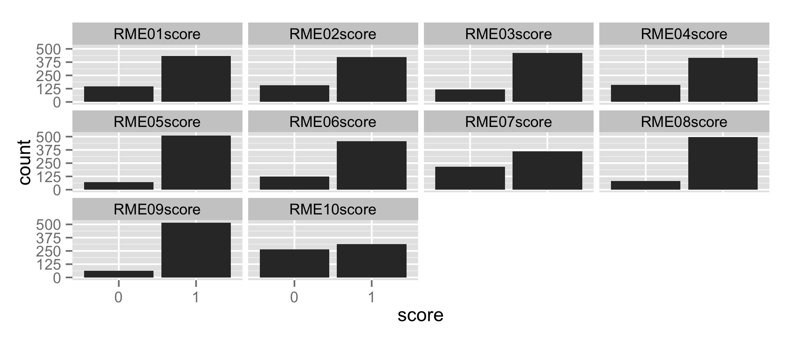

## Summary

This file reports data manipulations and analyses performed on an experiment studying the effects of power primes. Participants recruited via Mechanical Turk completed a power priming manipulation in which they were asked recall and visualize a time when they were high or low in power. After writing a description of their visualization, they completed a series of tasks to assess three dependent variables.

Participants'  **action/inaction intentions** were measured with 7 questions (e.g., "I am feeling energetic"; 1 = *not at all*, 7 = *extremely*; Albarracin, 2009, unpublished). 

Participants' **trust** was measured with two measures. Six items from the World Values Survey asked how much participants trust people belonging to different groups (e.g., "People you meet for the first time"; 1 = *trust completely*, 4 = *do not trust at all*). Participants also completed the trust game (Berg et al., 1995), which asked them how many raffle tickets they would entrust to another person who may or may not return them.

Two measures assessed participants' **perspective taking**. Participants answered seven items from the perspective-taking subscale of the Interpersonal Reactivity Index (Davis, 1980). These items were slightly modified to assess state rather than trait perspective taking motivation (e.g., "Before criticizing somebody, I'd try to imagine how I would feel if I were in their place"; 1 = *does not describe me at all*, 5 = *describes me very well*). Participants also completed 10 items from the Adult Reading the Mind in the Eyes Test-Revised (Baron-Cohen, Wheelwright, Hill, Raste & Plumb, 2001), which asked them to look at images of people's eyes and choose which of four emotions was expressed.

Participants completed measures for each of the dependent variables in a random order. For trust and perspective-taking, the two measures were also randomly ordered.

## Load the raw data

The data were collected using Qualtrics. The first row of the raw data file contains most of the variable names. The second row contains some further variable names and the question wording. Rows three and beyond contain participant data. So we will first load in the two sets of variable names and combine them. Then, we will load in the data.


```r
filename <- "PR__Priming_Power__3_DVs__Action_PerspectiveTaking_Distrust.csv"

name1 <- names(read.csv(filename, nrow = 1))
name2 <- names(read.csv(filename, nrow = 1, skip = 1))
names <- c(name2[1:22], name1[23:(length(name1))])
raw <- read.csv(filename, header = FALSE, skip = 2, col.names = names,
                stringsAsFactors = FALSE)
```

## Reduce data set to a final, usable set of cases

The final data set should only contain cases that represent:

+ US participants
+ Participants who passed the instructional manipulation check (IMC)

We will identify and count cases that do not meet these criteria. 


```r
# how many cases total?
totalCases <- nrow(raw)

# identify surveys from outside the US
nonUScount <- nrow(raw[with(raw, Country != "United States"),])

# identify participants who failed the IMC
failedIMCcount <- nrow(raw[with(raw, IMC != 10),])

# identify participants who meet both exclusion criteria
bothExcludeCount <- nrow(raw[with(raw, IMC != 10 & Country != "United States"),])

# create final data set and count cases
final <- raw[with(raw, IMC == 10 & Country == "United States"),]
finalCases <- nrow(final)
```

From 626 raw cases, 19 had non-US IP addresses and 29 failed the IMC (1 failed the IMC *and* had a non-US IP), leaving 579 for analysis.

## Create labels for categorical/ordinal demographic variables

The categorical and ordinal demographic variables (e.g., race, gender) are coded with numbers. We want to add category labels to these. 


```r
# ethnicity/race
final$ethnic2 <- factor(final$ethnic2,
                        levels = c(1,2,3,4,5,6),
                        labels = c("African American",
                                   "Asian American",
                                   "European American",
                                   "Latino/Latina",
                                   "Native American",
                                   "Other"))

# gender
final$gender <- factor(final$gender,
                       levels = c(1,2),
                       labels = c("Male", "Female"))

# income 
final$yyour <- factor(final$yyour,
                      levels = c(1,2,3,4,5,6,7,8),
                      labels = c("Under $15,000",
                                 "$15,001 - $25,000",
                                 "$25,000 - $35,000",
                                 "$35,001 - $50,000",
                                 "$50,001 - $75,000",
                                 "$75,001 - $100,000",
                                 "$100,001 - $150,000",
                                 "Over $150,000"))

# education 
final$youred <- factor(final$youred,
                       levels = c(1,2,3,4,5),
                       labels = c("Less than high school",
                                  "High school graduation or equivalent",
                                  "Some college", "College graduation",
                                  "Professional / Post-graduate degree"))
```

## Create condition variables for analyses

Conidition was recorded with a dummy code (0 = Low Power; 1 = High Power). We will convert these to effect codes with a 1 unit difference, weighted by the number of participants randomly assigned to the other condition. Weighted effect codes will produce regression coefficients that represent the mean difference between the groups. 


```r
# how many participants were assigned to each condition?
lowN <- nrow(final[final$Cond == 0,])
highN <- nrow(final[final$Cond == 1,])

# create weights
final$effect[final$Cond == 0] <- -highN / finalCases
final$effect[final$Cond == 1] <- lowN / finalCases
```

There were 299 and 280 participants in the Low and High Power conditions, respectively.

We will also turn the original dummy code into a factor, which will be useful for plotting and tables.


```r
final$Cond <- factor(final$Cond,
                     levels = c(0,1),
                     labels = c("Low Power", "High Power"))
```


## Exploratory data analysis

Before we run our preferred model, we should use exploratory data analysis to examine the distributions of variables and investigate the potential influence of order effects on the dependent variables.

### Descriptive summaries of demographic variables

First, we will look at the demographic composition of our sample.
 

```r
# Gender
table(final[,"gender"])
```

```
## 
##   Male Female 
##    222    357
```

```r
# Age
describe(final[,"age"])
```

```
##   vars   n  mean    sd median trimmed mad min max range skew kurtosis   se
## 1    1 579 32.06 13.17     29   30.26 8.9  18 227   209 6.24    81.73 0.55
```

```r
# Race/ethnicity
prop.table(table(final$ethnic2))
```

```
## 
##  African American    Asian American European American     Latino/Latina 
##        0.07599309        0.05872193        0.68221071        0.05872193 
##   Native American             Other 
##        0.01208981        0.11226252
```

```r
# Income
prop.table(table(final[,"yyour"]))
```

```
## 
##       Under $15,000   $15,001 - $25,000   $25,000 - $35,000 
##          0.20934256          0.15224913          0.14532872 
##   $35,001 - $50,000   $50,001 - $75,000  $75,001 - $100,000 
##          0.16782007          0.19377163          0.06747405 
## $100,001 - $150,000       Over $150,000 
##          0.05190311          0.01211073
```

```r
# Education
prop.table(table(final$youred))
```

```
## 
##                Less than high school High school graduation or equivalent 
##                           0.01036269                           0.09844560 
##                         Some college                   College graduation 
##                           0.35233161                           0.42314335 
##  Professional / Post-graduate degree 
##                           0.11571675
```

Overall, the sample looks similar to other Mechanical Turk samples.

### Examine distributions of dependent variables

Next, we will look at distributions of the dependent variables to assess whether there are issues with the way the data were recorded and whether there are obvious problems with the distributions.

#### Individual items

First, we should examine the individual items. Are there issues with how the data were recorded (e.g., impossible values, reverse keyed).

Before we look at the items, we will need to score the items of the Reading the Mind in the Eyes (RME) test.


```r
# the correct answers
answers <- c(1, 2, 3, 2, 3, 2, 3, 1, 4, 1)
answers <- answers + 18 # responses were recorded as 19 through 22

# for each item, initialize a score column with 0s, change to 1 if the
# participant got the right answer
for (i in 1:10) {
  colName <- names(final)[68 + i]
  newName <- paste(colName, "score", sep = "")
  final[, newName] <- 0
  final[final[, colName] == answers[i], newName] <- 1
}
```

Now we can look at the items.


```r
# Which columns represent items?
actionCols <- c(44:50) # action goals
wvsCols <- c(51:56) # World Values Survey trust
gameCol <- 58 # trust game
iriCols <- c(61:67) # IRI
rmeCols <- c(117:126) # RME
dvCols <- c(actionCols, wvsCols, gameCol, iriCols, rmeCols)

# Create long versions of the data set for each scale, where each item rating 
# for each participant is on a separate line
variable.names <- names(final)
actionDVs <- melt(final, id = "ResponseID",
                  measure.vars = variable.names[c(actionCols)])
wvsDVs <- melt(final, id = "ResponseID",
               measure.vars = variable.names[c(wvsCols)])
iriDVs <- melt(final, id = "ResponseID",
               measure.vars = variable.names[c(iriCols)])
rmeDVs <- melt(final, id = "ResponseID",
               measure.vars = variable.names[c(rmeCols)])
```

We'll look at plots for each set of variables.

 

The action/inaction items were recorded as 19 to 26, instead of 1 to 7.

 

One of the World Values Survey trust items has a severely skewed distribution. This is unsurprising as it indicates that most people trust their family completely.

 

There is a good spread of responses across the Trust Game, with an obvious mode around 500.

 

Like the action/inaction items, the IRI items were recorded beginning at 19 instead of 1.

 

Overall, people were fairly accurate on the Reading the Mind in Eyes items, though some of items show substantial proportions of people who answered incorrectly.
